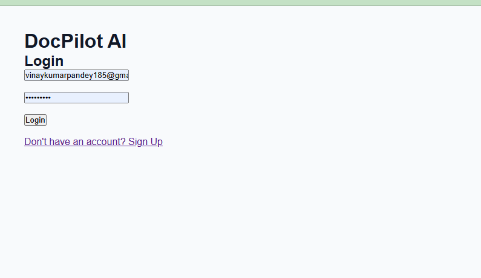
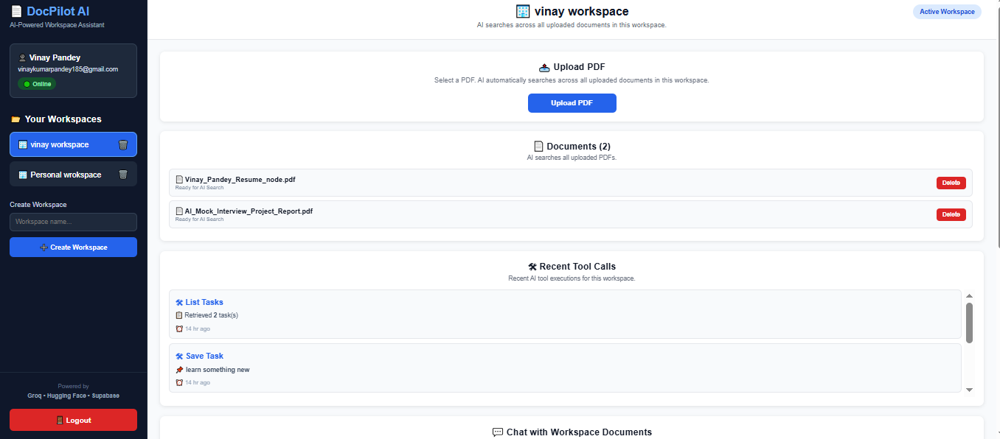
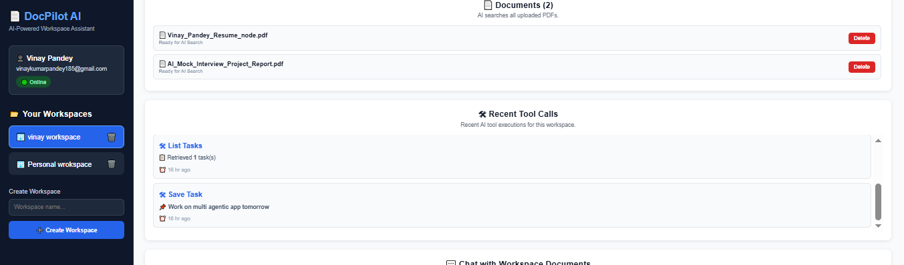
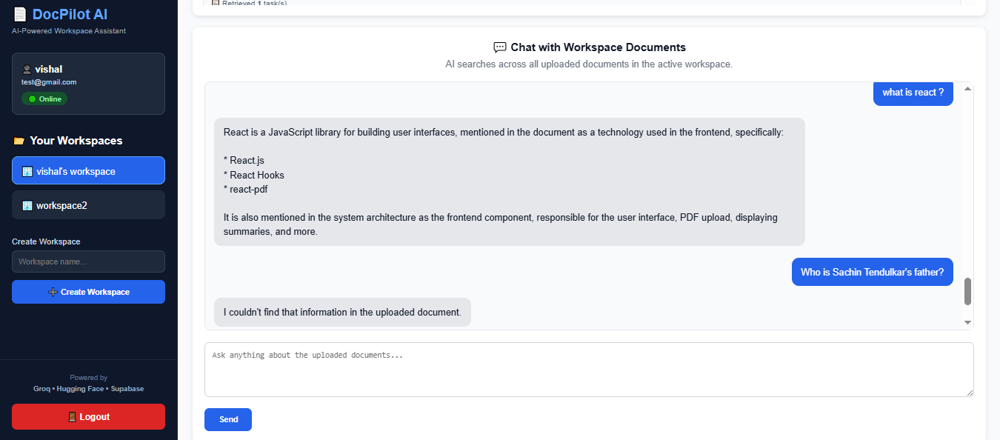

# 🚀 DocPilot AI

> **An AI-Powered PDF Assistant with Retrieval-Augmented Generation (RAG), Agentic AI, Tool Calling, and Workspace Isolation.**

DocPilot AI is a full-stack AI application that enables users to organize documents into isolated workspaces, upload PDF files, ask natural language questions, and receive context-aware answers powered by Retrieval-Augmented Generation (RAG).

The application combines **semantic search**, **vector embeddings**, and **large language models (LLMs)** to deliver accurate responses grounded in uploaded documents instead of relying on general AI knowledge.

In addition to document question answering, DocPilot AI supports **Agentic AI**, allowing the assistant to intelligently decide when to execute tools such as task management while maintaining a complete history of conversations and tool executions.

---

# ✨ Features

## 🔐 Authentication

- Secure user authentication using Supabase Auth
- User registration and login
- Protected dashboard routes
- Session persistence

---

## 📂 Workspace Management

- Create multiple workspaces
- Switch between workspaces
- Workspace-level document isolation
- Independent chat history for each workspace

---

## 📄 PDF Document Management

- Upload PDF documents
- Automatic PDF text extraction
- Automatic text chunking
- Duplicate document detection
- Delete uploaded documents
- Scrollable document list

---

## 🧠 Retrieval-Augmented Generation (RAG)

- Semantic search using vector embeddings
- Automatic embedding generation using Hugging Face
- Vector storage with pgvector (Supabase)
- Top relevant chunk retrieval
- AI answers grounded in uploaded documents
- Intelligent "I don't know" response when information is unavailable

---

## 🤖 AI Assistant

- Chat with uploaded PDFs
- Context-aware responses
- Source citation support
- Modern chat interface
- Chat history
- Workspace-specific conversations

---

## ⚙️ Agentic AI

The application includes an AI Agent capable of deciding whether a user request requires:

- Standard RAG Question Answering
- Tool Execution

Current supported tools:

- ✅ Save Task
- ✅ List Tasks

---

## 📋 Tool Logging

Every executed AI tool is automatically logged.

Logs include:

- Tool Name
- Arguments
- Execution Result
- Timestamp

Recent tool executions are displayed directly on the dashboard.

---

## 🎨 Modern Dashboard

- Workspace Switcher
- Upload PDF Card
- Document Manager
- Chat Window
- Chat History
- Tool Logs
- Responsive Layout
- Toast Notifications

---

# 🛠 Tech Stack

## Frontend

- React.js
- Vite
- Axios
- React Router
- Context API
- React Toastify

---

## Backend

- Node.js
- Express.js
- Multer
- pdf-parse
- Helmet
- Morgan
- CORS

---

## Artificial Intelligence

### Hugging Face

Used to generate semantic vector embeddings for:

- PDF chunks
- User questions

### Groq (Llama 3.3)

Used for:

- AI answer generation
- Agent reasoning
- Tool selection

---

## Database

- Supabase
- PostgreSQL
- pgvector

---

# 🏗 System Architecture

```text
                ┌─────────────────────────┐
                │     React Frontend      │
                └────────────┬────────────┘
                             │
                             ▼
                ┌─────────────────────────┐
                │    Express Backend      │
                └────────────┬────────────┘
                             │
          ┌──────────────────┼──────────────────┐
          ▼                  ▼                  ▼
   Workspace API      Document API        Chat API
          │                  │                  │
          ▼                  ▼                  ▼
     Supabase DB      PDF Processing      AI Agent
                             │                  │
                             ▼                  ▼
                     Hugging Face        Groq LLM
                             │                  │
                             ▼                  ▼
                     pgvector Search      Final Response
```

---

# 📌 Key Capabilities

- 🔐 Secure Authentication
- 📂 Multi-Workspace Support
- 📄 PDF Upload & Management
- 🧠 Semantic Search
- 🤖 Retrieval-Augmented Generation
- 📚 Source Citations
- 💬 Chat History
- ⚙️ Agentic AI
- 🛠 Tool Calling
- 📋 Tool Execution Logs
- 🚫 Duplicate Document Detection
- ⚡ Fast AI Responses using Groq

---

# 📁 Project Structure

```text
docpilot-ai/
│
├── client/
│   ├── public/
│   ├── src/
│   │
│   ├── components/
│   │   ├── chat/
│   │   │   └── ChatWindow.jsx
│   │   │
│   │   ├── common/
│   │   │   └── ProtectedRoute.jsx
│   │   │
│   │   ├── document/
│   │   │   ├── DocumentList.jsx
│   │   │   └── UploadCard.jsx
│   │   │
│   │   ├── layout/
│   │   │   ├── Header.jsx
│   │   │   └── Sidebar.jsx
│   │   │
│   │   └── tools/
│   │       └── ToolLogs.jsx
│   │
│   ├── context/
│   │   ├── AuthContext.jsx
│   │   └── WorkspaceContext.jsx
│   │
│   ├── pages/
│   │   ├── Dashboard.jsx
│   │   ├── Login.jsx
│   │   ├── Signup.jsx
│   │   └── NotFound.jsx
│   │
│   ├── routes/
│   │   └── AppRoutes.jsx
│   │
│   ├── services/
│   │   ├── api.js
│   │   ├── authService.js
│   │   ├── chatService.js
│   │   ├── documentService.js
│   │   ├── toolService.js
│   │   ├── workspaceService.js
│   │   └── supabase.js
│   │
│   ├── App.jsx
│   ├── main.jsx
│   └── index.css
│
├── server/
│   ├── src/
│   │
│   ├── agents/
│   │   └── agentService.js
│   │
│   ├── config/
│   │   ├── env.js
│   │   └── supabase.js
│   │
│   ├── controllers/
│   │   ├── chatController.js
│   │   ├── documentController.js
│   │   ├── toolController.js
│   │   └── workspaceController.js
│   │
│   ├── middleware/
│   │   ├── authMiddleware.js
│   │   └── uploadMiddleware.js
│   │
│   ├── repositories/
│   │   └── (Database Operations)
│   │
│   ├── routes/
│   │   ├── chatRoutes.js
│   │   ├── documentRoutes.js
│   │   ├── toolRoutes.js
│   │   └── workspaceRoutes.js


├── services/ai
        └── agentService.js
│   │   ├── embeddingService.js
│   │   ├── groqService.js
│   │   ├── retrievalService.js
│   │   
│   │
│   ├── services/
│   │   ├── vectorService.js
│   │   ├── chunkService.js
│   │   ├── documentService.js
│   │   ├── toolService.js
│   │   └── workspaceService.js
│   │
│   ├── utils/
│   │   └── hashFile.js
│   │
│   ├── app.js
│   └── server.js
│
├── .env.example
├── .gitignore
├── AI_NOTES.md
└── README.md
├── database/
│   ├── schema.sql
│   └── README.md
```

---

# ⚙️ Installation

## Clone the Repository

```bash
git clone https://github.com/VinayPandey185/docpilot-ai.git

cd docpilot-ai
```

---

## Install Backend Dependencies

```bash
cd server

npm install
```

---

## Install Frontend Dependencies

```bash
cd ../client

npm install
```

---

# 🔑 Environment Variables

## Backend (`server/.env`)

```env
PORT=5000

SUPABASE_URL=

SUPABASE_SERVICE_ROLE_KEY=

GROQ_API_KEY=

HF_API_KEY=
```

---

## Frontend (`client/.env`)

```env
VITE_SUPABASE_URL=

VITE_SUPABASE_ANON_KEY=
```

---

# ▶️ Run the Application

## Start Backend

```bash
cd server

npm run dev
```

Backend runs on:

```text
http://localhost:5000
```

---

## Start Frontend

```bash
cd client

npm run dev
```

Frontend runs on:

```text
http://localhost:5173
```

---

# 🚀 How DocPilot AI Works

## 1. Authentication

Users securely authenticate using Supabase Authentication.

↓

## 2. Workspace Selection

Users create or select an existing workspace.

Each workspace maintains:

- Documents
- Chat History
- Tool Logs
- Tasks

independently.

↓

## 3. PDF Upload

Users upload one or more PDF documents.

During upload:

- PDF text is extracted
- Text is split into chunks
- Embeddings are generated
- Chunks are stored in Supabase pgvector

↓

## 4. User Question

The user asks a question from the dashboard.

↓

## 5. Semantic Retrieval

The question is converted into an embedding.

The application retrieves the most relevant document chunks using vector similarity search.

↓

## 6. AI Agent

The Agent decides whether to:

- Generate a normal RAG answer

OR

- Execute a tool

↓

## 7. Final Response

The user receives:

- AI-generated answer
- Source citation
- Updated chat history
- Tool execution (if applicable)

---

# 📚 Folder Responsibilities

| Folder | Responsibility |
|---------|----------------|
| `client/src/components` | Reusable UI components such as Chat, Sidebar, Upload, Documents, and Tool Logs |
| `client/src/context` | Global state management using React Context API |
| `client/src/pages` | Application pages including Login, Signup, Dashboard, and NotFound |
| `client/src/routes` | Client-side routing and protected routes |
| `client/src/services` | Handles API communication with the backend |
| `server/src/controllers` | Receives HTTP requests and coordinates application flow |
| `server/src/routes` | Defines all REST API endpoints |
| `server/src/services` | Implements business logic, RAG pipeline, embedding generation, retrieval, and AI interaction |
| `server/src/repositories` | Performs database operations with Supabase and PostgreSQL |
| `server/src/agents` | AI Agent responsible for deciding whether to answer using RAG or execute backend tools |
| `server/src/middleware` | Authentication, authorization, and file upload middleware |
| `server/src/config` | Application configuration, environment variables, and Supabase client |
| `server/src/utils` | Helper utilities such as file hashing and reusable functions |


# 🔌 API Reference

## Authentication

### Register User

```http
POST /api/auth/signup
```

### Login User

```http
POST /api/auth/login
```

---

## Workspace APIs

### Get All Workspaces

```http
GET /api/workspaces
```

### Create Workspace

```http
POST /api/workspaces
```

---

## Document APIs

### Upload PDF

```http
POST /api/documents/upload
```

### Get Workspace Documents

```http
GET /api/documents/workspace/:workspaceId
```

### Delete Document

```http
DELETE /api/documents/:documentId
```

---

## Chat API

### Ask Question

```http
POST /api/chat
```

Request

```json
{
  "workspaceId": "workspace-id",
  "question": "What is React?"
}
```

Response

```json
{
  "answer": "...",
  "sources": [
    {
      "filename": "Resume.pdf",
      "pageNumber": 2
    }
  ]
}
```

---

## Tool APIs

### Get Tool Logs

```http
GET /api/tools/logs/:workspaceId
```

Returns all AI tool execution logs for the selected workspace.

---

# 🧠 Retrieval-Augmented Generation (RAG)

DocPilot AI uses a Retrieval-Augmented Generation (RAG) pipeline to ensure AI responses are grounded in uploaded documents instead of relying solely on general LLM knowledge.

### Upload Pipeline

```text
Upload PDF
      │
      ▼
Extract Text
      │
      ▼
Split into Chunks
      │
      ▼
Generate Embeddings
(Hugging Face)
      │
      ▼
Store Vectors
(pgvector)
```

---

### Question Answering Pipeline

```text
User Question
      │
      ▼
Generate Question Embedding
      │
      ▼
Semantic Search
(pgvector)
      │
      ▼
Retrieve Top Relevant Chunks
      │
      ▼
Groq LLM
      │
      ▼
Grounded AI Response
```

---

# 🤖 Agentic AI Workflow

Instead of always sending questions directly to the LLM, DocPilot AI first routes requests through an AI Agent.

The agent determines whether the request requires:

- Document Question Answering
- Tool Execution

Current supported tools:

- Save Task
- List Tasks

Workflow:

```text
User Question
      │
      ▼
Generate Embedding
      │
      ▼
Retrieve Context
      │
      ▼
AI Agent
      │
      ├──────────────┐
      ▼              ▼
Execute Tool     Generate RAG Answer
      │              │
      ▼              ▼
Save Tool Log    Return AI Response
      │              │
      └───────┬──────┘
              ▼
        Response to User
```

---

# 🛠 Tool Calling

The AI Agent can execute backend tools whenever appropriate.

Currently implemented tools:

| Tool | Description |
|------|-------------|
| Save Task | Creates a new task inside the current workspace |
| List Tasks | Retrieves all tasks for the active workspace |

Each execution is automatically recorded in the Tool Logs table for transparency and debugging.

---

# 💬 Chat History

Every AI conversation is stored in the database.

Each chat record includes:

- User Question
- AI Answer
- Workspace ID
- User ID
- Timestamp

Users can revisit previous conversations directly from the dashboard.

---

# 📚 Source Citations

Each AI response includes the most relevant document used to generate the answer.

Example:

```text
Answer:
React is a JavaScript library used to build user interfaces.

Source:
📄 Resume.pdf
```

This helps users verify the origin of AI-generated responses.

---

# Assignment Requirements Covered

The project implements all major assignment requirements.

### Authentication

- User Signup
- User Login
- Protected Routes

### Workspace Management

- Multiple Workspaces
- Workspace Isolation

### Document Processing

- PDF Upload
- Text Extraction
- Chunking
- Duplicate Detection

### Artificial Intelligence

- Vector Embeddings
- Semantic Search
- Retrieval-Augmented Generation
- Source Citations
- Honest "I don't know" responses

### Agentic AI

- Tool Selection
- Tool Execution
- Tool Logs

### User Experience

- Chat History
- Modern Dashboard
- Toast Notifications
- Responsive Layout

---

# 🚀 Deployment

The application can be deployed using the following services:

## Frontend

- Vercel

## Backend

- Render

## Database

- Supabase

### Deployment Steps

1. Deploy the backend to Render.
2. Configure backend environment variables.
3. Deploy the React frontend to Vercel.
4. Configure frontend environment variables.
5. Update API URLs.
6. Verify authentication, document upload, chat, and tool execution.

---

# 📈 Future Improvements

Although the current implementation satisfies the project requirements, several enhancements can be added in the future:

- Workspace deletion
- Rename workspace
- Drag & Drop PDF upload
- OCR support for scanned PDFs
- Streaming AI responses
- Hybrid Search (Keyword + Vector Search)
- Multi-step AI Agents
- Cross-workspace document search
- PDF page preview
- Export chat history
- User profile management
- Dark mode

---

# 📸 Screenshots

## Login Page



---

## Dashboard



---

## Tool Logs



---

## Chat with PDF



---


# 🤝 Contributing

Contributions, suggestions, and improvements are welcome.

If you would like to improve DocPilot AI:

1. Fork the repository.
2. Create a new feature branch.
3. Commit your changes.
4. Push the branch.
5. Open a Pull Request.

---

# 👨‍💻 Author

**Vinay Pandey**

GitHub

https://github.com/VinayPandey185

LinkedIn

https://www.linkedin.com/in/vinay-pandey-855579134/

---

# 📄 License

This project is developed for educational purposes as part of the **Abstrabit Technology AI Engineer Assignment**.

---

# 🙏 Acknowledgements

This project was built using:

- React.js
- Node.js
- Express.js
- Supabase
- PostgreSQL
- pgvector
- Hugging Face Inference API
- Groq Llama 3.3
- Vite

---

## ⭐ If you found this project useful, consider giving it a star on GitHub!